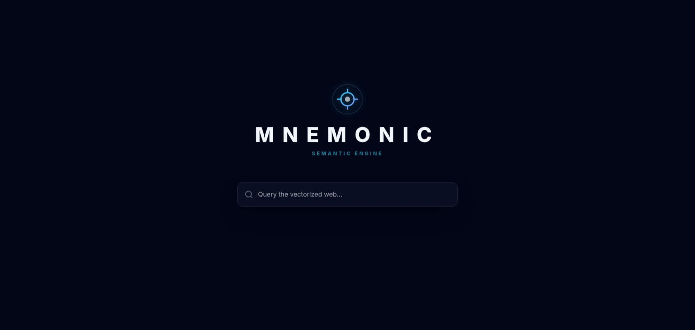
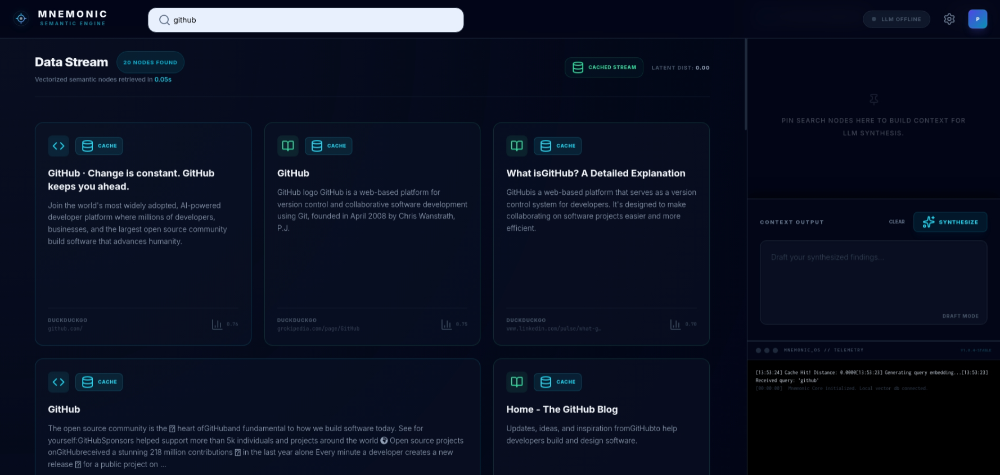

# Mnemonic: Semantic Meta-Search & Synthesis Engine

Mnemonic is a semantic search middleware that transforms raw web data into a vectorized knowledge stream. It leverages local AI to understand intent, recalibrate results based on feedback, and synthesize findings into actionable intelligence.

## Showcase

<p align="center">
  
  <br>
  <em>Minimalist landing page.</em>
</p>

<p align="center">
  
  <br>
  <em>Dense, multi-panel search workstation with Synthesis Workspace.</em>
</p>

## Key Features

- **Semantic Memory**: Uses **LanceDB** and **Sentence-Transformers** (`all-MiniLM-L6-v2`) to store and retrieve search results based on 384-dimensional query embeddings.
- **Synthesis Workspace**: Pin search results to a side canvas and use a **local LLM (via Ollama)** to generate summarized insights and drafts.
- **Bento Box UI**: A gapless, length-driven grid system that scales card sizes based on content volume, built with **Tailwind CSS** and **HTMX**.
- **Vector Recalibration**: A self-correcting feedback loop. Rejecting a result applies a negative penalty to the query vector, shifting the search focus away from irrelevant clusters.
- **Live Telemetry**: A terminal-style console providing real-time system logs and engine metrics via **Server-Sent Events (SSE)**.
- **Admin Dashboard**: Secure management portal (`/admin`) to monitor cache performance, view stored queries, and perform factory resets.

## Architecture

1.  **Aggregator**: Parallel multi-engine fetching (currently via DuckDuckGo, extensible to Google/Bing).
2.  **Refinement**: URL normalization, de-duplication, and semantic re-ranking using **BM25 + Cosine Similarity**.
3.  **Memory**: Vector database with configurable TTL, distance thresholds, and rejection-based conflict resolution.
4.  **Synthesis**: Local LLM integration (Llama 3/Mistral) for zero-latency context summarization.

## Getting Started

### Prerequisites
- Python 3.10+
- [Ollama](https://ollama.com/) (Optional, for synthesis features)
- `pip install -r requirements.txt`

### Configuration
Mnemonic uses a dual-configuration system to balance security and flexibility:

1.  **System Config (`.env`)**: Used for sensitive secrets and API keys.
    ```bash
    cp .env.example .env
    ```
2.  **App Config (`src/mnemonic/aggregator/*.json`)**: Used for operational settings (Search, Synthesis, Models). These can be updated live via the **Admin Dashboard**.
    *   `app_config.json`: General search and cache parameters.
    *   `llm_config.json`: Synthesis provider and model settings.
    *   `engines.json`: Search engine toggles.

**Key Settings:**
- `MNEMONIC_ADMIN_TOKEN`: Secure token for the admin dashboard (set in `.env`).
- `BRAVE_API_KEY`: API key for Brave Search provider (set in `.env`).
- `USE_HYDE`: Toggle hypothetical document expansion (set in Search Settings).
- `CACHE_TTL_DAYS`: How long results remain in semantic memory.

### Running with Docker (Recommended)
Mnemonic is fully containerized. To build and start the environment:

```bash
docker compose up -d
```
Visit `http://localhost:8000` to start querying.

**Note on Ollama & Docker**: If you are running Ollama on your host machine, the default `OLLAMA_BASE_URL` in `docker-compose.yml` is set to `http://host.docker.internal:11434`. This ensures the container can reach your local AI models for synthesis.

### Running Manually
```bash
# Start the FastAPI server
export PYTHONPATH=$PYTHONPATH:.
python3 src/mnemonic/api/main.py
```
Visit `http://localhost:8000` to start searching.

## Security
- **Admin Access**: Protected by token-based `HttpOnly` cookie authentication.
- **Privacy First**: Mnemonic acts as a pass-through processor; no external AI APIs are used. All synthesis happens locally on your hardware.

## Roadmap

The following ideas represent a steady evolution of the core search and synthesis experience.

- **Engine Expansion**: Integration of additional search providers (Brave Search, Bing, Google API) for higher result diversity.
- **Export to Markdown**: One-click download of your synthesized findings and pinned references into a clean document.
- **Advanced Filtering**: UI controls to filter results by domain, date, or content category (e.g., Code, News, Discussion).
- **Custom Synthesis Styles**: Choice between different summarization modes (e.g., Deep Research, Quick Summary, Bullet Points).
- **Admin Analytics**: Improved dashboard to visualize semantic memory trends and vector cluster patterns.
- **UI/UX Polish**: Continued aesthetic refinements, smoother transitions, and deeper mobile optimization.

## License
MIT License - See [LICENSE](LICENSE) for details.
